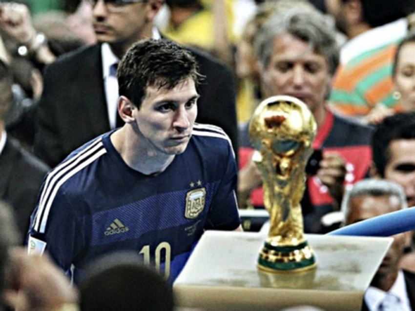
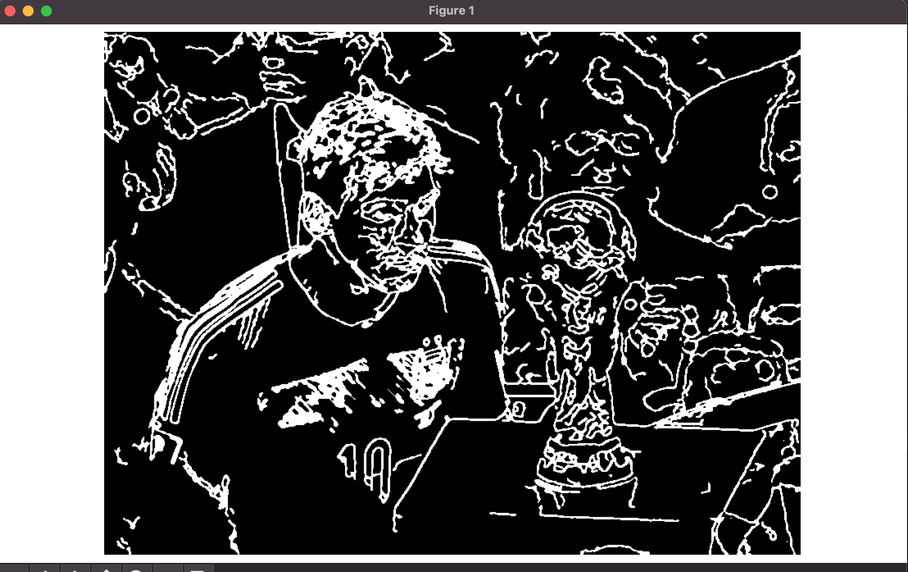

# Draw messi with python3:

```angular2html
python3 -m venv venv
source venv/bin/activate
pip3 install -r requirements.txt
python3 src/sketch.py -in img/messi.jpeg -o messi_o.jpeg -wt 850 -ht 638
```

---

<p align="center">
  
</p>

---

---

<p align="center">
  
</p>

---

### Directions to use:

1. Clone this repo: `git clone https://github.com/freesharedev/draw-messi.git`
2. Run: `python3 sketch.py -in <input_img_path> -o <output_file_path> -wt <width> -ht <height>`
    - `-in` (`--input`) : The input image's path
    - `-o` (`--output`) : The output file's name. The output will be an  `.eps` file, provide only the name without any extensions
    - `-wt` (`--width`), `-ht` (`--height`) : Decides the shape `(width, height)` to which the input image will be resized to. This is also the canvas size on which the turtle will draw.

---
